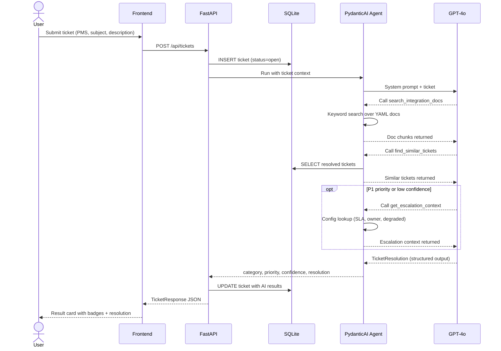

# Hospitality Integration Support Assistant

AI-powered support tool that diagnoses integration issues between Property Management Systems (Mews, Cloudbeds, Hostaway) and a guest experience platform. Submit a ticket, and a PydanticAI agent investigates using integration docs, past resolutions, and escalation context — returning a structured resolution with category, priority, and confidence.

Built as a demo for Pydantic Logfire observability.

## How it works

1. User submits a ticket with a PMS system, subject, and description
2. Ticket is saved to SQLite
3. A PydanticAI agent (GPT-4o, temperature=0) runs with 3 tools:
   - **search_integration_docs** — keyword search over YAML knowledge base
   - **find_similar_tickets** — matches against 26 pre-seeded resolved tickets
   - **get_escalation_context** — SLA/owner lookup (called for P1 or low confidence)
4. Agent returns structured output (category, priority, confidence, resolution)
5. Ticket is updated and result displayed in the frontend

## Request flow



## Setup

```
cp .env.example .env   # add your OPENAI_API_KEY
uv sync
git config core.hooksPath .githooks   # enable pre-commit formatting
make run               # http://localhost:8000
```

## Development

```
make check             # ruff lint + format check
make format            # auto-format
make reset-db          # delete DB (confirms first), re-seeds on next run
```

## Project structure

```
src/
  main.py          FastAPI app, routes, lifespan
  agent.py         PydanticAI agent + 3 tool implementations
  models.py        SQLAlchemy ORM (Ticket)
  schemas.py       Pydantic models (request/response, knowledge base validation)
  config.py        pydantic-settings (.env loading)
  database.py      async engine + session factory
  knowledge.py     YAML doc loader + keyword search
  seed.py          seed resolved tickets from YAML
data/
  docs/            integration docs per PMS (YAML)
  seeded_tickets.yaml
  escalation_config.yaml
frontend/
  index.html       single-file UI (submit, recent, past resolutions)
evals/             offline eval suite (TBD)
tests/             smoke tests
```
