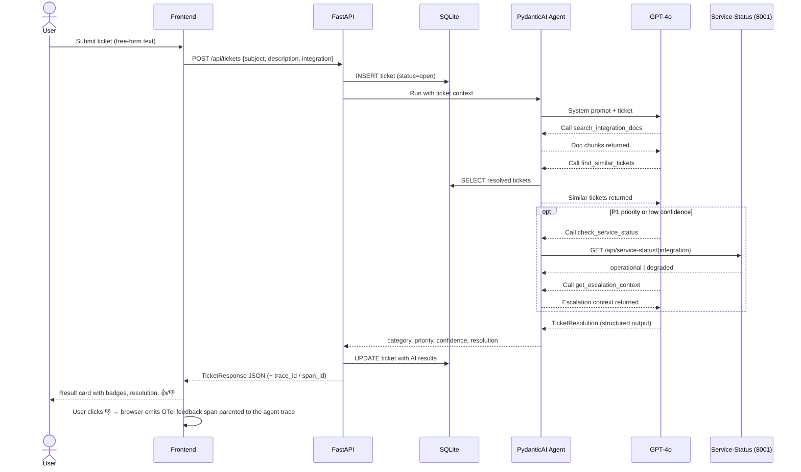

# Integration Support Assistant

AI-powered support tool that diagnoses issues with common third-party integrations (Stripe, Twilio, SendGrid). Submit a ticket, and a PydanticAI agent investigates using integration docs, past resolutions, and live upstream service status — returning a structured resolution with category, priority, and confidence.

Built as a demo for Pydantic Logfire observability.

## How it works

1. User submits a ticket describing the issue
2. Ticket is saved to SQLite
3. A PydanticAI agent (GPT-4o, temperature=0) runs with 4 tools:
   - **search_integration_docs** — keyword search over YAML knowledge base (Stripe, Twilio, SendGrid)
   - **find_similar_tickets** — matches against pre-seeded resolved tickets
   - **check_service_status** — calls a mock upstream-status service (port 8001) to check if the provider is degraded
   - **get_escalation_context** — SLA/owner lookup (called for P1 or low confidence)
4. Agent returns structured output (category, priority, confidence, resolution)
5. Ticket is updated and the result displayed in the frontend, where the user can leave 👍/👎 feedback

## Request flow



## Setup

```
cp .env.example .env   # add OPENAI_API_KEY, LOGFIRE_API_KEY, LOGFIRE_BROWSER_WRITE_TOKEN
uv sync
git config core.hooksPath .githooks   # enable pre-commit formatting
make run               # http://localhost:8000
```

## Development

```
make check             # ruff lint + format check
make format            # auto-format
make reset-db          # delete DB (confirms first), re-seeds on next run
make evals             # run offline evals against the curated Logfire dataset
```

## Project structure

```
src/
  main.py                 FastAPI app, routes, lifespan
  agent.py                PydanticAI agent + 4 tool implementations
  status_service_app.py   Mock upstream-status microservice (port 8001)
  models.py               SQLAlchemy ORM (Ticket)
  schemas.py              Pydantic models (request/response, knowledge base validation)
  config.py               pydantic-settings (.env loading)
  database.py             async engine + session factory
  knowledge.py            YAML doc loader + keyword search
  seed.py                 seed resolved tickets from YAML
data/
  docs/                   integration docs per service (stripe / twilio / sendgrid YAML)
  seeded_tickets.yaml
  escalation_config.yaml
  service_status.yaml
frontend/
  index.html              single-file UI (submit, recent, history)
evals/                    offline eval suite + curated-dataset loader
tests/                    smoke tests
```

## The eval flywheel

The repo demonstrates the full **online → offline → fix** loop:

1. **Online evals** — every prod agent run is scored by 4 evaluators (`EscalationJudge`, `EvidenceJudge`, `ResolutionQualityScore`, `ReferenceKind`). Scores land as span attributes (`gen_ai.evaluation.*`) on the agent trace in Logfire.
2. **Browser feedback** — the 👍/👎 buttons emit OpenTelemetry spans from the browser, parented to the agent's `support_ticket_resolution` span. Negative feedback is queryable in Logfire SQL.
3. **Curation** — in Logfire, filter low-score / thumbs-down traces and "Add to dataset" → `integration-support-prod-curated`. Annotate expected outputs.
4. **Offline regression** — `make evals` runs the static + curated cases through the agent and compares against expected output. Reproduces prod regressions locally.
5. **Prompt iteration** — the system prompt is managed via a Logfire variable (`prompt__new_prompt`); change it, re-run evals, ship when green.
